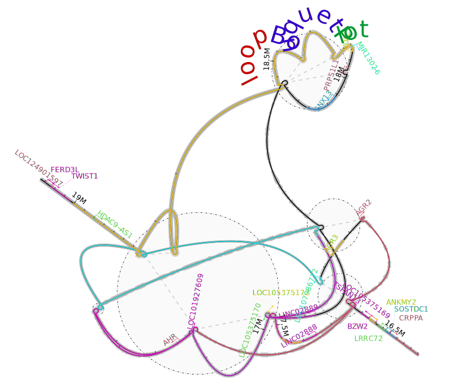

Function demo for trackViewer::loopBouquetPlot
================
Authors: Jianhong Ou[^1]<br/>
Last modified: 2024-02-09

## Overview

The `loopBouquetPlot` is a new method introduced by **trackViewer**
package to visualize genomic interactions along with annotation for NGS
dataset such as HiC, HiChIP, PLAC-seq, ChIA-PET, and HiCAR data.

### Pre-requisites

- Basic knowledge of R syntax
- Basic knowledge of Docker if use Docker
- Basic knowledge of shell commands
- A computer with internet connection

### Installation

To install this package, start R and enter:

``` r
library(BiocManager)
BiocManager::install("jianhong/loopBouquetPlotDocumentation")
```

Or try with **this** repository docker image:

``` sh
docker run \
  -e PASSWORD=<choose_a_password_for_rstudio> \
  -p 8787:8787 \
  ghcr.io/jianhong/loopbouquetplotdocumentation:latest
```

Once running, navigate to <http://localhost:8787/> and then login with
`rstudio`:`yourchosenpassword`.

*NOTE*: Running docker that uses the password in plain text like above
exposes the password to others in a multi-user system (like a shared
workstation or compute node). In practice, consider using an environment
variable instead of plain text to pass along passwords and other secrets
in docker command lines.

If you are running M1/M2 chip, although RStudio server will not work,
you still can try:

``` sh
mkdir tmp4output
docker run -it \
  -v ${PWD}/tmp4output:/home/rstudio/output \
  --platform linux/x86_64 \
  ghcr.io/jianhong/loopbouquetplotdocumentation:latest \
  bash
cd output && R
```

Once it is run, please output the figures to output folder like this:

``` r
pdf('plot.pdf')
loopBouquetPlot(...)
dev.off()
```

And you will see the plots in tmp4output folder on host machine like
this.



### Documentation

To view documentation of loopBouquetPlotDocumentation, start R and
enter:

``` r
browseVignettes("loopBouquetPlotDocumentation")
```

The source code for showcases are available at
[Fig1](https://jianhong.github.io/loopBouquetPlotDocumentation/articles/Fig1.html)
and
[BrainComparativeEpigenome](https://jianhong.github.io/loopBouquetPlotDocumentation/articles/BrainComparativeEpigenome.html)

### Contributions and Support

If you would like to contribute to this package, the standard workflow
is as follows:

1.  Check that there isn’t already an issue about your idea in the
    [jianhong/loopBouquetPlotDocumentation/issues](https://github.com/jianhong/loopBouquetPlotDocumentation/issues)
    to avoid duplicating work. If there isn’t one already, please create
    one so that others know you’re working on this
2.  [Fork](https://help.github.com/en/github/getting-started-with-github/fork-a-repo)
    the
    [jianhong/loopBouquetPlotDocumentation](https://github.com/jianhong/loopBouquetPlotDocumentation)
    to your GitHub account
3.  Make the necessary changes / additions within your forked repository
    following [Bioconductor
    contribution](https://contributions.bioconductor.org/)
4.  Use `devtools::build` and `devtools::check` to check the package
    work properly.
5.  Submit a Pull Request against the `master` or current
    `RELEASE_VERSION` branch and wait for the code to be reviewed and
    merged

If you’re not used to this workflow with git, you can start with some
[docs from
GitHub](https://help.github.com/en/github/collaborating-with-issues-and-pull-requests)
or even their [excellent `git` resources](https://try.github.io/).

For further information or help, don’t hesitate to get in touch on the
[Bioconductor support site](https://support.bioconductor.org/) with tag
`#trackViewer`.

### Reporting bug/issues

Many thanks for taking an interest in improving this package. Please
report bug/issues at
[jianhong/loopBouquetPlotDocumentation/issues](https://github.com/jianhong/loopBouquetPlotDocumentation/issues).

[^1]: Regeneration Center, Duke University, Durham, North Carolina, USA.
